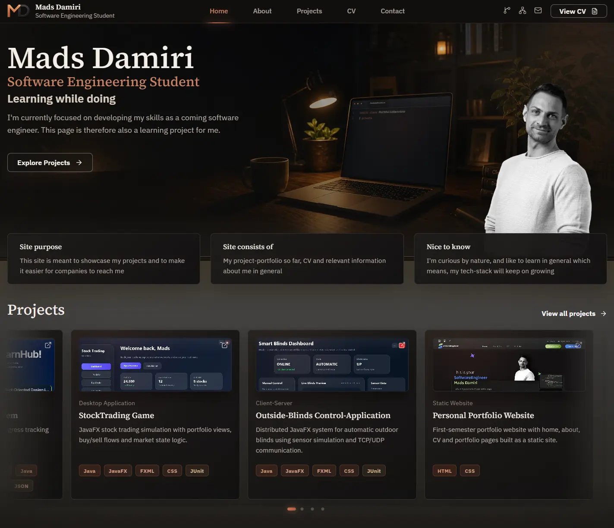

# Mads Damiri – Portfolio Website

A personal portfolio built with **React** and **TypeScript**.
### [View live website →](https://software.madsdamiri.dk)



The purpose of this project is to present who I am as a software engineering student, showcase the projects I have worked on, and support applications for trainee and student developer opportunities.

---

## Why I built this

This project is my personal portfolio and CV website. It is built to present who I am, what I am learning, the projects I have worked on, and the direction I am moving in as a software engineering student.
The website is designed as a warm, informational portfolio with and a form of visual identity. It combines a personal introduction, selected software projects, an about page, a CV page and a contact page in one focused experience.

The purpose of the site is to support applications for trainee and student developer opportunities, while also giving visitors a better sense of my technical interests, work style and learning journey. 

I am currently preparing for my 3rd semester in Software Engineering, which starts in September 2026.

---

## Features

- responsive design
- project portfolio with filtering
- project detail pages
- About, CV and Contact pages

---

## Tech stack

- React
- TypeScript
- Vite
- CSS

---

## Project structure

```text
src/
├── assets/
├── components/
├── data/
├── hooks/
├── styles/
├── types/
└── utils/
```

The project separates reusable UI, data, styling and helper functions to keep responsibilities clear as the application grows.

---

## Current status

I'm preparing for my 3rd semester in Software Engineering at VIA University College.

Current focus:

- backend development
- full-stack development
- software architecture
- databases
- building maintainable software

---

## Future plans

As I continue learning, I'll keep expanding the portfolio with new projects and improve the existing ones whenever I discover better ways of structuring or implementing the application.

The goal is for this repository to document my development as a software engineer rather than remain a finished product.
